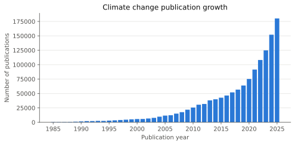
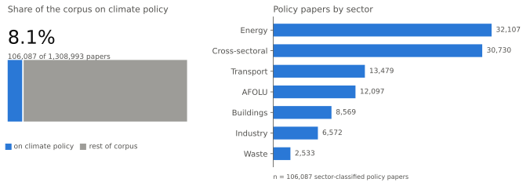

# WGIII Section 1 — literature growth

The literature on climate change has continued to grow since AR6. 
The bibliometric methods of Callaghan et al. (2020) were re-applied to an updated corpus of ~1,310,000 climate-relevant Scopus records (1985–2025).
Annual publications rose from ~64,000 in 2019 to ~180,000 in 2025, (at an annual growth rate of 19%).
565,263 papers (43% of the corpus) appeared in 2022–2025, after the AR6 literature cut-off (Figure X).

420,954 papers (32% of the literature) address Working Group III subject matter as measured from the IPCC's own citations (see below); this share has grown from 30% in 2019 to 37% in 2025.
Within this corpus, a subset of (106,087 papers (8% of the corpus) were classified as climate policy relevant according to the classifier in Callaghan et al. 2024. 
Climate policy relevant papers grew from ~4,800 in 2019 to ~14,000 (2025) (growing at ≈20% per year).
The climate policy relevant papers published between 2022 and 2025 (n = 47,834) were split across sectors as follows energy 30%; cross-sectoral 29%; transport 13%; AFOLU 10%; buildings 8%; industry 7%; waste 2%.

These figures reflect publications indexed in Scopus, which over-represents English-language journals and high-income-country institutions; they illustrate relative growth in publications rather than total global scientific knowledge.

WG III-relevance is calculated by cross-refererencing a 200-topic topic model (following the methods described in Callaghan et al 2020), with AR6's reference lists.
Each topic is assigned WG III citation share - the fraction of that topic's IPCC citations contributed by WG III chapters - and each paper's WG III content fraction is the average of these shares across its topics, weighted by how strongly each topic features in the paper.
Papers scoring above one third - more WG III content than an equal split across the three Working Groups - are counted as WG III-relevant.

## Values and provenance

| Value | Computed |
| --- | --- |
| corpus size (unique records, 1985–2025) | 1,308,993 |
| papers 2019 | 63,870 |
| papers 2025 | 180,220 |
| growth factor 2019→2025 | 2.8× |
| compound growth | 19%/yr |
| papers 2022–2025 | 565,263 |
| share of corpus 2022–2025 | 43% |
| policy-relevant papers (total) | 106,087 |
| policy-relevant share | 8% |
| relevant CAGR 2019 → 2025 | ~4,800 → ~14,000 (≈20%/yr) |
| sector split n (2022–2025) | 47,834 |
| sector split shares | energy 30%; cross-sectoral 29%; transport 13%; AFOLU 10%; buildings 8%; industry 7%; waste 2% |
| WG III-relevant papers | 420,954 (32% of 1985–2025) |
| WG III-relevant share 2019 → 2025 | 30% → 37% |

Filters: unique `item_id`; publication year 1985–2025
(cover year, from `data/predictions`); policy-relevant = `relevant` >
0.5; sector = argmax over the `"8 - …"` sector
score columns; WG III-relevant = topic content score ≥ 1/3, per-year counts
from `report/tables/wgiii_docs_by_year_a200.csv` (written by `python -m
climate_literature.topics.wg counts`; rule and validation in
`scripts/wg3_tune.py`). Shares use the year-dated subset of the corpus.
